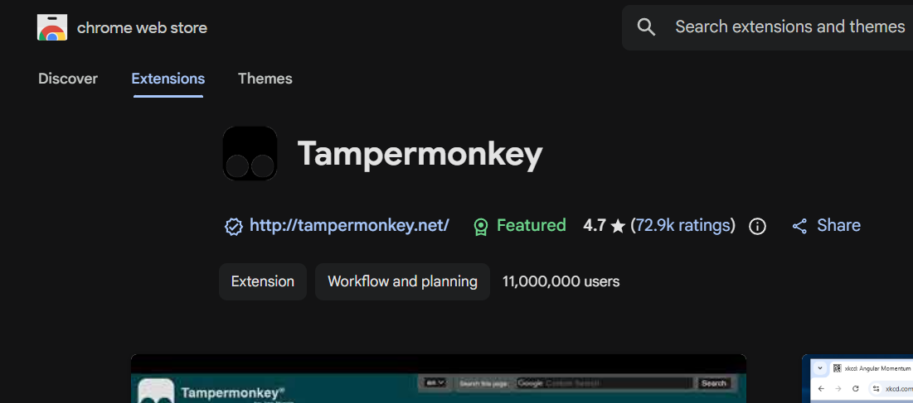
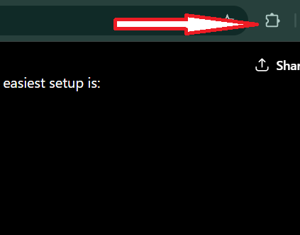
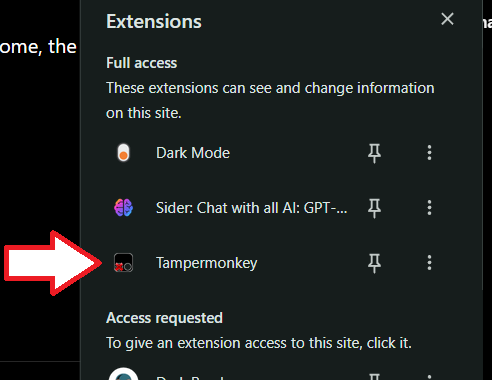
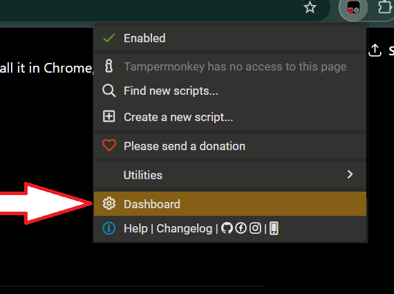
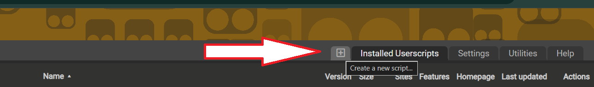

# bridgeon-timer

Step 1: Install Tampermonkey

Install the Tampermonkey extension in Chrome.

Open Chrome Web Store.
Search for Tampermonkey.
Click Add to Chrome.

Confirm installation.
You should see the Tampermonkey icon near the address bar.

Step 2: Open Tampermonkey Dashboard

Click the Tampermonkey icon.
Click Dashboard.
Step 3: Create a New Script

Click the + button or Create a new script.
Delete the default sample code.
Paste bridgeon-attendance.user.js script.
Press Ctrl + S to save.

refresh https://student.bridgeon.in/attendance

unpin when you pin the website, after doing you can pin
